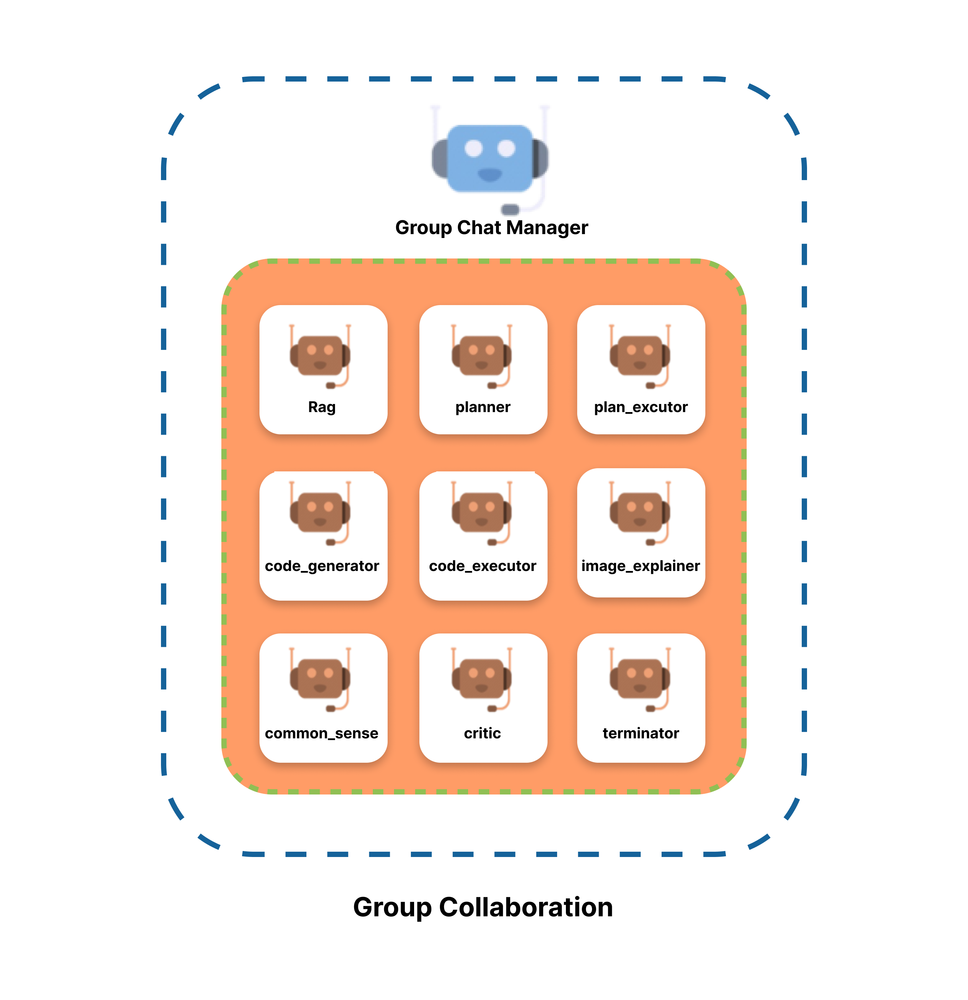
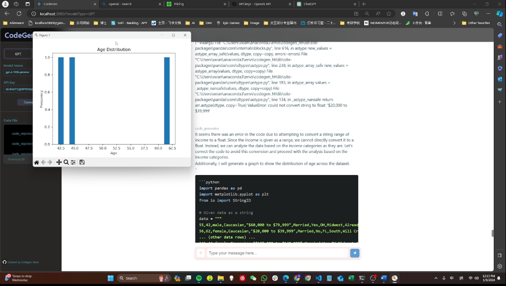
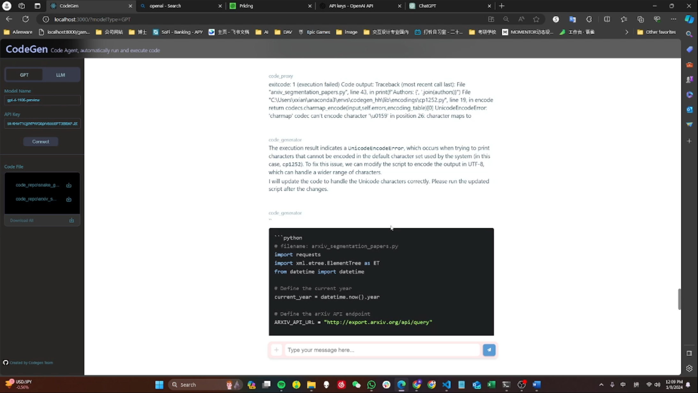
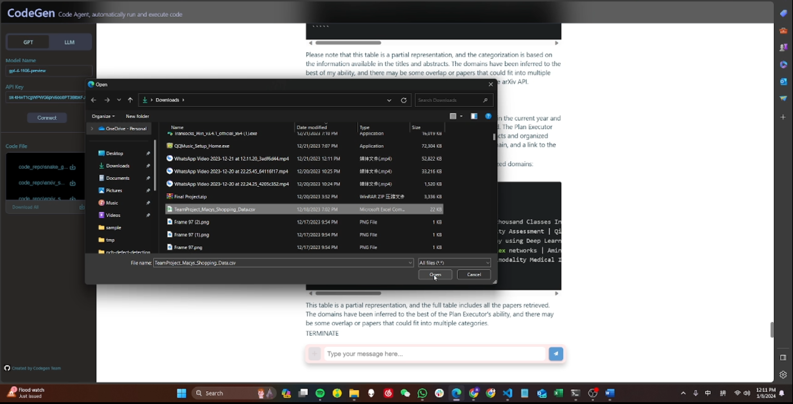
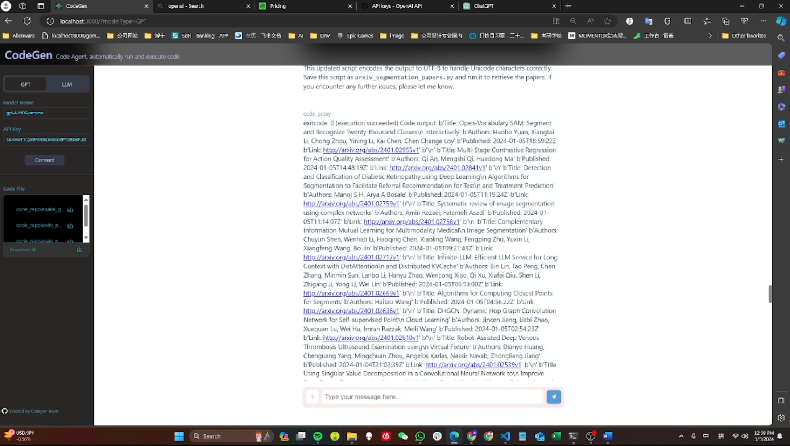

[English](README.md) / [简体中文](README_CH.md)

# AutoGen Enhanced Project with 9 Agents

## Project Introduction
This project, Codegen, built on Microsoft AutoGen, implements 9 efficiently collaborating agents to support complex code requirement processing, code self-execution, and iteration. The project stands out for its unique combination of features, particularly in advanced code processing and iteration. The frontend is built with the Flask framework, and the backend uses React, ensuring user-friendly interfaces and efficient backend processing.In the future, we will focus on program level multi program file generation and interpertation.


## Key Features
- **Code Team Collaboration:** Effective handling of complex code requirements through the collaboration of 9 agents.
- **EDA:** Explore Data Analyse 

- **Code Self-Execution and Iteration:** Implements automatic code execution and feedback-based iterative improvement.

- **Document Reading and Understanding:** Utilizes RAG (Retrieval-Augmented Generation) functionality to effectively process and understand a large volume of documents.

- **website scraping**

- **Image Processing Capability:** Capable of reading and interpreting images, supporting various image analysis scenarios.
- **Support for Large Language Model (LLM) URLs** Large language models can utilize the GPT-4 API (recommended) or the free LLM URLs (described later).

- **Code Download and Retrieval** (In Progress)

- **Batch Code File Interpretation** (In Progress)

- **Cross-File Code Debugging and Search** (In Progress)

- **Image Generation Interface** (In Progress)

### For more details check the demo videos in our file. 

## Technology Stack
- **Frontend:** Flask
- **Backend:** React

## Getting Started
Follow these steps to set up and run the project:

**Clone the repository:**
```bash
git clone https://github.com/Xin-Ray/CodeGen.git
```
## Installing Dependencies:
- **Frontend:
Backend:
```bash
cd path/to/backend/autogen_modifi
pip install .
```
## Starting the Server:
- **Frontend:**
```bash
npm start
```
- **Backend:**
```bash
Copy code
python flask_websockeGPT.py
```

## How to Use LLM's URL

**Method 1:** You can download a large language model (LLM) locally using tools like LM Studio, start a server, and then copy the server link. Paste this link into our page and you can leave the `model_name` field blank.

**Method 2:** Run `Mistral7B.ipynb` in Colab to obtain the link. Copy and paste this link into our page, and you can also leave the `model_name` field blank.

**Note:** The functionality of Mistral7B is not stable, as it has a smaller number of parameters and weaker inference capabilities, making effective team collaboration difficult. 

**Motivation：**The initial purpose of creating the LLM URL feature was driven by the high cost of GPT-4. We hope that in the future, there will be open-source and free large language models with fewer parameters that can run on local computers and have inference capabilities surpassing humans. Such models could be directly integrated into our framework to achieve better scalability.


## Contribution Guide
We welcome all forms of contributions, whether suggestions for new features, code submissions, or issue reports. Please follow these steps:

1. Fork the project repository.
2. Create a new feature branch (git checkout -b my-new-feature).
3. Commit your changes (git commit -am 'Add some feature').
4. Push to the branch (git push origin my-new-feature).
5. Create a new Pull Request.

## License
This project follows the MIT License.

## References
AutoGen official website: https://microsoft.github.io/autogen/docs/Contribute
AutoGen GitHub: https://github.com/microsoft/autogen

## Contact
Currently seeking job opportunities
For any questions or suggestions, please contact [xxiang@mail.yu.edu].

## Development Team
Yeshiva University Codegen Team lead by xinxiang

Instructor：Professor Honggang Wang

group member:Deepa, Manish, Pinxue Lin, Xin Xiang


